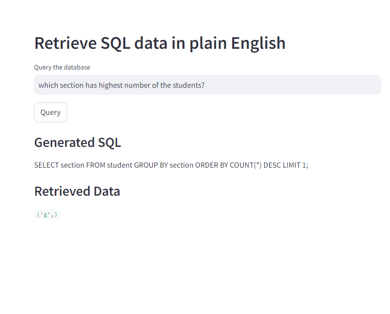

# Text2SQL
## Intro
This tool allows you to query to database using natural language i.e. english

Mode of Working for this project is as:
You (USER) => English => gpt4o-mini => SQL => database query executed

## Tools used
1. langchain
2. openai (gpt-4o-mini)
3. streamlit

## Preview
